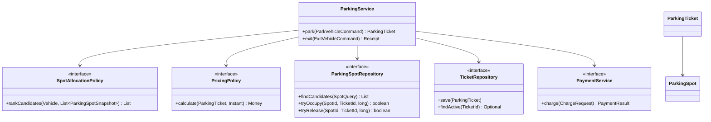

# Parking Lot LLD and Concurrency

> A living study guide for learning low-level design through a realistic Parking Lot system.
>
> **Primary example language:** Java 21+  
> **Design goal:** Correctness first, then extensibility, observability, and performance.

## How to use this guide

Do not memorize the classes. Learn the reasoning sequence:

1. Clarify requirements and constraints.
2. State the invariants that must never be violated.
3. Identify responsibilities and model the domain.
4. Define interfaces before choosing implementations.
5. Find shared mutable state and make its atomic boundaries explicit.
6. Choose a concurrency strategy based on contention and storage.
7. Test behavior, failure paths, and concurrent interleavings.
8. Optimize only after measuring a correct design.

The standalone visual version is in [`parking-lot-lld-concurrency.html`](./parking-lot-lld-concurrency.html).

---

## 1. Learning objectives

By the end of this module, you should be able to:

- turn ambiguous requirements into a focused LLD;
- separate entities, value objects, services, repositories, and policies;
- apply SOLID principles without creating unnecessary abstractions;
- recognize useful Strategy, Factory, Repository, State, Observer, and Facade patterns;
- explain race conditions, critical sections, atomicity, visibility, and ordering;
- compare mutexes, semaphores, atomic variables, optimistic locking, and pessimistic locking;
- prevent two entry requests from receiving the same parking spot;
- design idempotent entry, exit, payment, and release operations;
- identify scaling limits and evolve an in-memory design into a persistent, distributed design;
- test concurrency with invariants rather than relying only on happy-path examples.

---

## 2. Start with requirements, not classes

### 2.1 Functional requirements for the first version

1. A parking lot contains multiple floors and entry/exit gates.
2. A floor contains parking spots of different types.
3. The system supports motorcycles, cars, electric cars, and trucks.
4. A vehicle receives one compatible available spot at entry.
5. Entry creates a parking ticket with an entry timestamp.
6. Exit calculates a fee, accepts payment, closes the ticket, and releases the spot.
7. A display can show available counts by floor and spot type.
8. Operators can add or disable floors, gates, and spots.

### 2.2 Explicitly deferred features

Keep the first design focused. Defer these until the core is correct:

- reservations;
- valet workflows;
- license-plate recognition;
- dynamic pricing;
- monthly subscriptions;
- lost-ticket resolution;
- charging-session billing;
- multi-region operation.

### 2.3 Non-functional requirements

- **Correctness:** never assign one spot to two active tickets.
- **Consistency:** spot availability and ticket state agree.
- **Thread safety:** concurrent gate requests preserve all invariants.
- **Low latency:** allocation should avoid scanning the entire facility when possible.
- **Auditability:** state transitions and payments are traceable.
- **Extensibility:** new vehicle, spot, pricing, and allocation policies require localized changes.
- **Availability:** retries must not create duplicate tickets or payments.

### 2.4 Questions a senior engineer asks

Before drawing a class diagram, ask:

- Is this a single-process interview exercise or a production, multi-instance service?
- Is state kept only in memory or persisted in a relational database?
- How many spots, floors, gates, and requests per second are expected?
- Must allocation return the nearest spot, any spot, or a reserved spot?
- Can one vehicle have multiple active tickets?
- What happens if payment succeeds but releasing the spot fails?
- Should an electric car be allowed in a regular car spot?
- Are accessible spots modeled, and who is eligible to use them?
- What is the source of time and currency rules?

The answers determine the concurrency and persistence design. There is no universally best lock.

---

## 3. Model invariants before behavior

An invariant is a condition that must be true after every successful operation.

### Core invariants

1. A parking spot has at most one active ticket.
2. An active ticket refers to exactly one occupied spot.
3. A closed ticket cannot become active again.
4. A paid payment cannot be charged again for the same idempotency key.
5. A spot can be released only by the ticket that owns it.
6. An unavailable or maintenance spot cannot be allocated.
7. The available count equals the actual number of allocatable spots for the same scope.
8. A vehicle has at most one active ticket when that business rule is enabled.

### Why invariants matter

A method-level statement such as “`park()` is synchronized” is not enough. Correctness can involve several records and methods. For example, occupying a spot and creating its ticket form one business transaction. If one succeeds and the other fails, the system violates invariants even if every individual collection is thread-safe.

---

## 4. Domain model

### 4.1 Entities

Entities have stable identity and a lifecycle.

| Entity | Identity | Important state |
|---|---|---|
| `ParkingLot` | lot ID | floors, gates, operating state |
| `ParkingFloor` | floor ID | spots, display board |
| `ParkingSpot` | spot ID | type, status, current ticket, version |
| `ParkingTicket` | ticket ID | vehicle, spot, entry/exit time, status |
| `Payment` | payment ID | ticket, amount, method, status, idempotency key |
| `Gate` | gate ID | gate type and operating state |

### 4.2 Value objects

Value objects are immutable and compared by value.

- `VehicleRegistration`
- `Money(amount, currency)`
- `SpotId`, `TicketId`, `FloorId`, `GateId`
- `TimeRange`
- `Address`

Use small types instead of passing raw strings everywhere. A `TicketId` cannot then be accidentally passed where a `SpotId` is expected.

### 4.3 Enums

```java
public enum VehicleType {
    MOTORCYCLE,
    CAR,
    ELECTRIC_CAR,
    TRUCK
}

public enum SpotType {
    MOTORCYCLE,
    COMPACT,
    LARGE,
    ELECTRIC,
    ACCESSIBLE
}

public enum SpotStatus {
    AVAILABLE,
    HELD,
    OCCUPIED,
    OUT_OF_SERVICE
}

public enum TicketStatus {
    ACTIVE,
    PAYMENT_PENDING,
    PAID,
    CLOSED,
    LOST
}
```

`HELD` is useful when allocation and final entry confirmation are separate steps. If the first version performs both atomically, it may be unnecessary.

### 4.4 Aggregate boundary

For a small in-memory implementation, `ParkingLot` can be the aggregate root and protect all spot/ticket transitions with one lock. This is simple and safe but limits throughput.

For a persistent service, a smaller transactional boundary is better:

- the selected `ParkingSpot` row;
- the newly created `ParkingTicket` row;
- the relevant idempotency record;
- an outbox event, if other systems must be notified.

These changes should commit atomically in one database transaction.

---

## 5. High-level class relationships



The service orchestrates a use case. Policies make decisions. Repositories hide storage. Entities enforce local state transitions.

---

## 6. API and use-case design

Prefer commands with explicit request identities over long parameter lists.

```java
public record ParkVehicleCommand(
        String requestId,
        Vehicle vehicle,
        GateId entryGateId,
        Instant requestedAt) {
}

public record ExitVehicleCommand(
        String requestId,
        TicketId ticketId,
        GateId exitGateId,
        PaymentMethod paymentMethod,
        Instant requestedAt) {
}

public interface ParkingUseCases {
    ParkingTicket park(ParkVehicleCommand command);

    Receipt exit(ExitVehicleCommand command);
}
```

`requestId` is an idempotency key. If a gate times out and retries the same request, the service returns the first result instead of allocating a second spot.

### Entry flow

1. Validate the command and gate.
2. Return the previous result if `requestId` was already completed.
3. Determine compatible spot types.
4. Fetch and rank a bounded set of candidates.
5. Atomically claim one candidate.
6. Create the active ticket in the same transaction.
7. Commit an idempotency record and optional outbox event.
8. Return the ticket.

### Exit flow

1. Return the previous receipt for a completed `requestId`.
2. Load and validate the active ticket.
3. Calculate the fee using the pricing policy.
4. Charge through an idempotent payment adapter.
5. Mark the ticket paid/closed and release its exact spot atomically.
6. Store the receipt and publish an outbox event.

For an external payment provider, one local ACID transaction cannot include the network call. Use an explicit payment state machine, idempotency keys, and a recovery/reconciliation path.

---

## 7. SOLID applied pragmatically

### S — Single Responsibility Principle

A class should have one reason to change.

- `NearestSpotAllocationPolicy` changes when allocation ranking changes.
- `HourlyPricingPolicy` changes when pricing rules change.
- `JdbcParkingSpotRepository` changes when persistence details change.
- `ParkingService` changes when use-case orchestration changes.

Avoid a `ParkingLotManager` that allocates spots, calculates fees, calls payment APIs, writes SQL, sends notifications, and formats receipts.

### O — Open/Closed Principle

Add new behavior through stable interfaces:

```java
public interface SpotAllocationPolicy {
    List<ParkingSpotSnapshot> rankCandidates(
            Vehicle vehicle,
            List<ParkingSpotSnapshot> candidates);
}

public interface PricingPolicy {
    Money calculate(ParkingTicket ticket, Instant exitTime);
}
```

A new weekend pricing policy should not require editing the parking workflow.

### L — Liskov Substitution Principle

Implementations must preserve interface contracts. If `PaymentService.charge()` promises idempotent charging by request ID, every adapter must honor that behavior. A fake implementation that charges twice is not substitutable even if its method signature matches.

Prefer composition over an inheritance tree such as `CarSpot extends ParkingSpot`. Spot type is usually data, while allocation compatibility is policy.

### I — Interface Segregation Principle

Do not force clients to depend on methods they do not use.

```java
public interface SpotReader {
    List<ParkingSpotSnapshot> findCandidates(SpotQuery query);
}

public interface SpotWriter {
    boolean tryOccupy(SpotId spotId, TicketId ticketId, long expectedVersion);
    boolean tryRelease(SpotId spotId, TicketId ticketId, long expectedVersion);
}
```

A display board may need only `SpotReader`; it should not receive allocation mutation methods.

### D — Dependency Inversion Principle

High-level workflow code depends on abstractions, not SQL or a payment SDK.

```java
public final class DefaultParkingService {
    private final SpotReader spotReader;
    private final SpotWriter spotWriter;
    private final TicketRepository ticketRepository;
    private final SpotAllocationPolicy allocationPolicy;
    private final PricingPolicy pricingPolicy;
    private final PaymentService paymentService;
    private final Clock clock;

    public DefaultParkingService(
            SpotReader spotReader,
            SpotWriter spotWriter,
            TicketRepository ticketRepository,
            SpotAllocationPolicy allocationPolicy,
            PricingPolicy pricingPolicy,
            PaymentService paymentService,
            Clock clock) {
        this.spotReader = Objects.requireNonNull(spotReader);
        this.spotWriter = Objects.requireNonNull(spotWriter);
        this.ticketRepository = Objects.requireNonNull(ticketRepository);
        this.allocationPolicy = Objects.requireNonNull(allocationPolicy);
        this.pricingPolicy = Objects.requireNonNull(pricingPolicy);
        this.paymentService = Objects.requireNonNull(paymentService);
        this.clock = Objects.requireNonNull(clock);
    }
}
```

Inject `Clock` so time-based behavior can be tested deterministically.

---

## 8. Design patterns that earn their place

| Pattern | Parking Lot use | Why it helps | Warning |
|---|---|---|---|
| Strategy | allocation and pricing | swaps business policies independently | do not create one class per trivial conditional |
| Factory | select policy from facility configuration | centralizes construction | factory should not become a service locator |
| Repository | spots, tickets, payments | hides storage and supports test doubles | do not leak database entities into domain logic |
| State | ticket/payment transitions | makes legal transitions explicit | an enum plus transition methods may be enough |
| Observer / Domain Event | display, audit, notifications | decouples post-commit reactions | publish only after commit or use an outbox |
| Facade | entry/exit API | provides a cohesive use-case boundary | facade should orchestrate, not own every detail |

### 8.1 Strategy example

```java
public final class NearestSpotAllocationPolicy implements SpotAllocationPolicy {
    @Override
    public List<ParkingSpotSnapshot> rankCandidates(
            Vehicle vehicle,
            List<ParkingSpotSnapshot> candidates) {
        return candidates.stream()
                .filter(spot -> spot.canFit(vehicle))
                .filter(ParkingSpotSnapshot::isAvailable)
                .sorted(Comparator
                        .comparingInt(ParkingSpotSnapshot::distanceFromEntry)
                        .thenComparing(spot -> spot.id().value()))
                .toList();
    }
}
```

The policy ranks candidates but does **not** claim one. Claiming is a concurrency-sensitive storage operation.

### 8.2 State transition example

```java
public final class ParkingTicket {
    private TicketStatus status;

    public void beginPayment() {
        requireStatus(TicketStatus.ACTIVE);
        status = TicketStatus.PAYMENT_PENDING;
    }

    public void markPaid() {
        requireStatus(TicketStatus.PAYMENT_PENDING);
        status = TicketStatus.PAID;
    }

    public void close() {
        requireStatus(TicketStatus.PAID);
        status = TicketStatus.CLOSED;
    }

    private void requireStatus(TicketStatus expected) {
        if (status != expected) {
            throw new IllegalStateException(
                    "Ticket transition rejected: expected " + expected
                            + " but current status is " + status
                            + "; check for duplicate or out-of-order requests");
        }
    }
}
```

In a concurrent persistent system, entity validation must be backed by a conditional database write. An in-memory check alone cannot protect against another service instance.

---

## 9. Concurrency foundations

### 9.1 Thread, process, and request

- A **process** is a running program with its own address space.
- A **thread** is an execution path within a process; threads share heap memory.
- A server request may run on a platform thread, a virtual thread, or an event-loop task.
- Multiple service instances do not share JVM locks, so distributed correctness must live in shared storage or a coordination service.

### 9.2 The classic race condition

Assume spot `A-17` is available:

```text
Gate A reads A-17 = AVAILABLE
Gate B reads A-17 = AVAILABLE
Gate A writes A-17 = OCCUPIED(ticket-101)
Gate B writes A-17 = OCCUPIED(ticket-102)
```

Both gates may return success. One write overwrites the other, and one ticket points to a spot it does not own.

The unsafe operation is not the individual read or write. It is the compound **check-then-act** sequence:

```java
if (spot.isAvailable()) {
    spot.occupy(ticketId);
}
```

That sequence must be atomic with respect to competing requests.

### 9.3 Three properties to understand

- **Atomicity:** an operation appears indivisible; observers see all or none of it.
- **Visibility:** a thread sees writes performed by another thread.
- **Ordering:** operations are observed in a valid order despite compiler/CPU reordering.

A design can have visibility without compound atomicity. For example, `volatile int count` makes writes visible, but `count++` is still a read-modify-write race.

### 9.4 Thread safety

A component is thread-safe when it preserves its contract and invariants under all supported concurrent calls without requiring callers to add synchronization.

Common techniques:

1. immutability;
2. thread confinement;
3. stateless services;
4. mutex/synchronized locking;
5. atomic variables and compare-and-set;
6. concurrent collections;
7. database transactions and conditional writes;
8. message serialization or actor-style ownership.

Thread-safe parts do not automatically create a thread-safe whole. Two `ConcurrentHashMap` updates are not one atomic business transaction.

---

## 10. Mutexes and Java locks

A **mutex** provides exclusive ownership of a critical section. Only one thread can hold it at a time.

### 10.1 `synchronized`

```java
public synchronized ParkingTicket park(Vehicle vehicle) {
    // The monitor protects the complete allocation transition.
}
```

Advantages:

- simple syntax;
- automatic unlock when control exits;
- JVM-supported reentrancy and visibility guarantees.

Limitations:

- one lock may serialize unrelated operations;
- no timed or interruptible lock acquisition API;
- a JVM monitor does not coordinate other service instances.

### 10.2 `ReentrantLock`

```java
private final Lock allocationLock = new ReentrantLock(true);

public ParkingTicket park(Vehicle vehicle) {
    allocationLock.lock();
    try {
        return allocateUnderLock(vehicle);
    } finally {
        allocationLock.unlock();
    }
}
```

Use `try/finally`; otherwise an exception can leave the lock held forever.

`ReentrantLock` supports:

- `tryLock()`;
- timed acquisition;
- interruptible acquisition;
- multiple `Condition` objects;
- optional fairness.

Fair locks reduce starvation but commonly reduce throughput. Choose fairness only for an actual requirement.

### 10.3 Lock granularity

- **One lot-wide lock:** easiest to reason about; lowest concurrency.
- **One floor lock:** unrelated floors progress concurrently.
- **One spot lock:** high concurrency; selection and multi-record transitions become harder.
- **Striped locks:** a bounded lock set protects groups of spots; balances memory and contention.

If an operation needs multiple locks, acquire them in one global order to reduce deadlock risk.

---

## 11. Semaphores

A **semaphore** manages a number of permits. Unlike a mutex, it can allow more than one concurrent holder.

```java
private final Semaphore entryCapacity = new Semaphore(20, true);

public ParkingTicket handleEntry(ParkVehicleCommand command) {
    boolean acquired = entryCapacity.tryAcquire();
    if (!acquired) {
        throw new EntryBusyException(
                "Entry request rejected because all processing permits are in use; retry shortly");
    }
    try {
        return parkingUseCases.park(command);
    } finally {
        entryCapacity.release();
    }
}
```

Good uses:

- limit simultaneous gate processing;
- protect a constrained downstream dependency;
- bound expensive work;
- model a pool of interchangeable resources.

Dangerous shortcut:

A semaphore initialized with the number of free spots can drift from reality after crashes, retries, maintenance changes, or partial failures. It also does not identify **which** spot was claimed. Use it as admission control or an optimization, not as the authoritative parking inventory.

### Mutex versus semaphore

| Property | Mutex | Semaphore |
|---|---|---|
| Permits | exactly one | one or more |
| Ownership | unlocking thread should own it | permits are not ownership-bound |
| Primary purpose | protect a critical section | bound concurrent access/capacity |
| Parking example | protect allocation state | limit concurrent entry workflows |

---

## 12. Atomic variables and compare-and-set

Atomic variables perform lock-free atomic operations on a single memory location.

```java
private final AtomicLong ticketSequence = new AtomicLong();

public TicketId nextTicketId() {
    return new TicketId("T-" + ticketSequence.incrementAndGet());
}
```

For state transitions, compare-and-set (CAS) means:

> Change the value to `newValue` only if it still equals `expectedValue`.

```java
public final class InMemorySpot {
    private final SpotId id;
    private final SpotType type;
    private final AtomicReference<SpotOccupancy> occupancy =
            new AtomicReference<>(SpotOccupancy.available());

    public boolean tryOccupy(TicketId ticketId) {
        SpotOccupancy expected = SpotOccupancy.available();
        SpotOccupancy occupied = SpotOccupancy.occupiedBy(ticketId);
        return occupancy.compareAndSet(expected, occupied);
    }

    public boolean tryRelease(TicketId ticketId) {
        SpotOccupancy expected = SpotOccupancy.occupiedBy(ticketId);
        return occupancy.compareAndSet(expected, SpotOccupancy.available());
    }
}
```

This requires `SpotOccupancy` to be immutable with correct value equality.

### What atomics solve well

- counters;
- sequence numbers within one process;
- flags;
- immutable single-object state transitions;
- low-contention CAS loops.

### What atomics do not solve automatically

- an atomic change spanning spot, ticket, payment, and available-count records;
- coordination between separate JVMs;
- fairness;
- complicated invariants across several mutable objects;
- crash recovery.

Under high contention, CAS can repeatedly fail and retry. Lock-free does not mean wait-free, starvation-free, or always faster.

---

## 13. Optimistic locking

Optimistic locking assumes conflicts are uncommon. Readers do not hold a lock while deciding. A writer succeeds only if the record has not changed since it was read.

### 13.1 Version-based algorithm

1. Read spot `A-17` with `status = AVAILABLE` and `version = 8`.
2. Build a candidate ticket.
3. Conditionally update the spot where `version = 8` and status is still available.
4. If one row changed, this request won.
5. If zero rows changed, another request won; try another candidate or retry with a bound.

```sql
UPDATE parking_spot
SET status = 'OCCUPIED',
    current_ticket_id = :ticket_id,
    version = version + 1
WHERE spot_id = :spot_id
  AND status = 'AVAILABLE'
  AND version = :expected_version;
```

The affected-row count is the CAS result.

### 13.2 Repository contract

```java
public interface SpotWriter {
    boolean tryOccupy(
            SpotId spotId,
            TicketId ticketId,
            long expectedVersion);

    boolean tryRelease(
            SpotId spotId,
            TicketId ticketId,
            long expectedVersion);
}
```

### 13.3 Bounded allocation loop

```java
public ParkingTicket allocate(ParkVehicleCommand command) {
    List<ParkingSpotSnapshot> ranked = allocationPolicy.rankCandidates(
            command.vehicle(),
            spotReader.findCandidates(SpotQuery.forVehicle(command.vehicle())));

    for (ParkingSpotSnapshot candidate : ranked) {
        TicketId ticketId = ticketIds.next();
        boolean claimed = spotWriter.tryOccupy(
                candidate.id(), ticketId, candidate.version());

        if (claimed) {
            ParkingTicket ticket = ParkingTicket.open(
                    ticketId,
                    command.vehicle(),
                    candidate.id(),
                    command.requestedAt());
            ticketRepository.save(ticket);
            return ticket;
        }
    }

    throw new ParkingFullException(
            "No compatible spot could be claimed; candidates were unavailable or concurrently allocated");
}
```

**Production correction:** `tryOccupy`, ticket insertion, and idempotency insertion must participate in the same database transaction. The simplified snippet shows responsibilities, not the complete transaction manager wiring.

### 13.4 Benefits

- no lock held while business logic ranks candidates;
- good throughput when collisions are rare;
- works naturally with version columns and conditional writes;
- deadlocks are less likely than in multi-row pessimistic workflows.

### 13.5 Costs

- callers must handle conflicts;
- retries can waste work;
- high contention can cause retry storms or starvation;
- side effects must occur only after winning or must be idempotent.

Use a bounded retry count with jittered backoff where appropriate. Never retry an external charge without an idempotency key.

---

## 14. Pessimistic locking

Pessimistic locking assumes collisions are likely or too costly. A transaction locks data before changing it.

```sql
BEGIN;

SELECT spot_id, version
FROM parking_spot
WHERE floor_id = :floor_id
  AND spot_type IN (:compatible_types)
  AND status = 'AVAILABLE'
ORDER BY distance_from_entry, spot_id
FOR UPDATE SKIP LOCKED
LIMIT 1;

UPDATE parking_spot
SET status = 'OCCUPIED',
    current_ticket_id = :ticket_id,
    version = version + 1
WHERE spot_id = :spot_id;

INSERT INTO parking_ticket (...)
VALUES (...);

COMMIT;
```

`SKIP LOCKED` lets competing transactions skip rows another allocator already locked, where supported by the database.

### Benefits

- straightforward reasoning for hot records;
- loser waits or skips rather than rebuilding work;
- convenient for a small transactional set.

### Costs

- waiting increases latency;
- long transactions reduce throughput;
- inconsistent lock ordering can deadlock;
- lock behavior depends on the database and isolation level;
- never hold a database transaction open while calling a payment provider.

### Deadlock prevention

- keep transactions short;
- lock rows in a deterministic order;
- avoid unnecessary multi-row locks;
- configure timeouts;
- detect and retry deadlock-victim transactions safely;
- collect lock-wait and deadlock metrics.

---

## 15. Choosing the right concurrency mechanism

| Mechanism | Scope | Best fit | Main limitation |
|---|---|---|---|
| immutable object | any | values and snapshots | cannot model mutation alone |
| `synchronized` / mutex | one process | simple in-memory aggregate | no cross-instance protection |
| `ReentrantLock` | one process | timed/fair/interruptible locking | no cross-instance protection |
| semaphore | one process or distributed variant | admission control | not resource identity or transactionality |
| atomic variable / CAS | one process | one-value transitions | multi-object invariants are difficult |
| optimistic DB lock | multiple instances | low/moderate contention | conflicts require bounded retry |
| pessimistic DB lock | multiple instances | high-contention short transactions | waiting and deadlocks |
| serialized partition/actor | partition scope | very high write coordination | routing and availability complexity |

### Recommended interview answer

- Begin with a lot-wide mutex for a correct single-process implementation.
- Explain its throughput limit.
- For a multi-instance service, move correctness into the database.
- Prefer a conditional update/version column when contention is moderate.
- Consider `FOR UPDATE SKIP LOCKED` for consistently hot candidate rows.
- Keep payment out of long-held locks and database transactions.
- Add idempotency and observability in either design.

This demonstrates evolution rather than premature complexity.

---

## 16. Thread-safe in-memory reference design

The following design is intentionally coarse-grained. One lock protects the aggregate transition across spot and ticket maps. It is a strong first implementation because the atomic boundary is obvious.

```java
public final class ThreadSafeParkingLot {
    private static final int MAX_ID_LENGTH = 128;

    private final Map<SpotId, MutableSpot> spotsById;
    private final Map<TicketId, ParkingTicket> activeTickets = new HashMap<>();
    private final SpotAllocationPolicy allocationPolicy;
    private final Lock stateLock = new ReentrantLock();
    private final AtomicLong ticketSequence = new AtomicLong();
    private final Clock clock;

    public ThreadSafeParkingLot(
            Collection<MutableSpot> spots,
            SpotAllocationPolicy allocationPolicy,
            Clock clock) {
        this.spotsById = spots.stream().collect(Collectors.toUnmodifiableMap(
                MutableSpot::id,
                Function.identity()));
        this.allocationPolicy = Objects.requireNonNull(allocationPolicy);
        this.clock = Objects.requireNonNull(clock);
    }

    public ParkingTicket park(Vehicle vehicle) {
        Objects.requireNonNull(vehicle, "vehicle is required");

        stateLock.lock();
        try {
            List<ParkingSpotSnapshot> candidates = spotsById.values().stream()
                    .map(MutableSpot::snapshot)
                    .filter(ParkingSpotSnapshot::isAvailable)
                    .toList();

            ParkingSpotSnapshot selected = allocationPolicy
                    .rankCandidates(vehicle, candidates)
                    .stream()
                    .findFirst()
                    .orElseThrow(() -> new ParkingFullException(
                            "No compatible parking spot is available for vehicle type "
                                    + vehicle.type()));

            TicketId ticketId = new TicketId(
                    "T-" + ticketSequence.incrementAndGet());
            MutableSpot spot = spotsById.get(selected.id());
            spot.occupy(ticketId);

            ParkingTicket ticket = ParkingTicket.open(
                    ticketId, vehicle, spot.id(), clock.instant());
            activeTickets.put(ticketId, ticket);
            return ticket;
        } finally {
            stateLock.unlock();
        }
    }

    public ParkingTicket release(TicketId ticketId) {
        Objects.requireNonNull(ticketId, "ticketId is required");

        stateLock.lock();
        try {
            ParkingTicket ticket = Optional.ofNullable(activeTickets.get(ticketId))
                    .orElseThrow(() -> new TicketNotFoundException(
                            "Active ticket was not found for " + ticketId
                                    + "; check whether the request was already completed"));

            MutableSpot spot = spotsById.get(ticket.spotId());
            spot.releaseOwnedBy(ticketId);

            ParkingTicket closed = ticket.closeAt(clock.instant());
            activeTickets.remove(ticketId);
            return closed;
        } finally {
            stateLock.unlock();
        }
    }
}
```

### Why this is thread-safe

- all compound changes to spots and active tickets use the same lock;
- lock release establishes visibility to the next lock holder;
- returned tickets/snapshots should be immutable;
- the sequence is atomic, although it is also called under the lock;
- no mutable internal collection is exposed.

### What to improve for production

- durable IDs rather than a process-local sequence;
- request idempotency;
- payment state and recovery;
- database transactions;
- bounded candidate queries;
- structured audit events and metrics;
- fault injection and concurrent stress tests;
- authorization and operator controls.

---

## 17. Data structures and indexing

A full scan is acceptable for a tiny interview example but not for a large facility.

### In memory

Possible index:

```text
Map<FloorId, Map<SpotType, NavigableSet<SpotCandidate>>>
```

The sorted set can order spots by distance and ID. Every allocation/release must update the spot and index under one atomic boundary. Maintaining duplicated state increases correctness risk.

### Relational database

Useful indexes depend on query shape. For example:

```sql
CREATE INDEX parking_spot_candidate_idx
ON parking_spot (floor_id, spot_type, status, distance_from_entry, spot_id);
```

Measure query plans with realistic cardinality. Do not add every imaginable index; writes pay for each one.

### Available counters

Treat cached counters as projections, not the source of truth. Update them transactionally when possible, or rebuild/reconcile them from spot rows. A display may tolerate slight staleness; allocation may not.

---

## 18. Distributed-system concerns

JVM locks disappear once traffic reaches multiple service instances.

### 18.1 Idempotency

Store a uniqueness constraint on `(operation_type, request_id)` and persist the result. Concurrent duplicate requests should converge on one ticket/receipt.

### 18.2 Database constraints

Use constraints as a final safety net:

- unique active ticket per spot;
- unique idempotency key per operation;
- valid status values;
- non-null ownership fields when occupied;
- optional unique active ticket per vehicle.

A partial unique index may model “only one active ticket,” depending on database support.

### 18.3 Transactional outbox

Write the business change and an outbox event in the same transaction. A separate worker publishes the event and marks it delivered. This avoids “database committed but notification was lost.” Consumers must still be idempotent because delivery is commonly at least once.

### 18.4 Cache correctness

Do not allocate from a cache unless it supports the required atomic claim semantics and recovery model. A cache can accelerate candidate discovery, but the authoritative conditional write should decide the winner.

### 18.5 Failure example: payment succeeds, local update fails

Use the payment request ID for provider idempotency. Persist `PAYMENT_PENDING` before the call, record provider results, retry reconciliation, and make ticket closure repeatable. Do not solve this by holding a spot lock during an unbounded network call.

---

## 19. Testing strategy

Test behavior and invariants. Avoid tests coupled to private methods or exact implementation structure.

### 19.1 Unit tests

- compatibility policy accepts and rejects expected spot types;
- allocation policy ranks nearest candidates deterministically;
- pricing policy handles boundaries and rounding;
- illegal ticket transitions fail with actionable errors;
- releasing with the wrong ticket fails;
- no compatible spot produces `ParkingFullException`;
- retries with the same request ID return the same result.

### 19.2 Concurrent test: one spot, many callers

```java
@Test
void allocatesSingleSpotToAtMostOneConcurrentCaller() throws Exception {
    int callerCount = 100;
    ExecutorService executor = Executors.newFixedThreadPool(16);
    CountDownLatch ready = new CountDownLatch(callerCount);
    CountDownLatch start = new CountDownLatch(1);

    List<Future<Boolean>> attempts = IntStream.range(0, callerCount)
            .mapToObj(index -> executor.submit(() -> {
                ready.countDown();
                start.await();
                try {
                    parkingLot.park(vehicle("CAR-" + index));
                    return true;
                } catch (ParkingFullException expected) {
                    return false;
                }
            }))
            .toList();

    assertTrue(ready.await(5, TimeUnit.SECONDS));
    start.countDown();

    long successes = 0;
    for (Future<Boolean> attempt : attempts) {
        if (attempt.get(5, TimeUnit.SECONDS)) {
            successes++;
        }
    }

    executor.shutdownNow();
    assertEquals(1, successes);
    assertEquals(1, parkingLot.activeTicketCount());
    assertEquals(0, parkingLot.availableSpotCount());
}
```

A start latch increases collision probability; it does not prove correctness for every interleaving. Run stress tests repeatedly and assert invariants after each run.

### 19.3 Integration tests

- optimistic conflict returns a controlled retry outcome;
- transaction rollback leaves no occupied spot without a ticket;
- duplicate idempotency keys return the original result;
- a deadlock victim can retry safely;
- outbox publishing is eventually delivered without duplicate effects;
- payment reconciliation closes a paid ticket after a transient local failure.

### 19.4 Useful metrics

- allocation latency percentiles;
- allocation conflict rate;
- optimistic retry count;
- lock wait duration;
- database deadlock count;
- no-spot rejection rate by spot type;
- payment reconciliation backlog;
- invariant-reconciliation mismatch count.

---

## 20. Common design mistakes

1. **Starting with subclasses for every noun.** Prefer data plus policies unless subtype behavior is genuinely different.
2. **Using Singleton for global state.** It hides dependencies, complicates tests, and does not work across instances. Use dependency injection and explicit lifecycle ownership.
3. **Assuming `ConcurrentHashMap` makes a workflow atomic.** It protects map operations, not cross-map invariants.
4. **Marking everything `volatile`.** Visibility is not compound atomicity.
5. **Using a semaphore as the inventory database.** Permits can drift and do not name a spot.
6. **Holding a lock while making network calls.** This creates high latency and failure amplification.
7. **Retrying forever.** Use bounded retries, deadlines, backoff, and a clear error outcome.
8. **Publishing events before commit.** Consumers can observe a change that later rolls back.
9. **Ignoring idempotency.** Timeouts cause retries even when clients behave correctly.
10. **Optimizing before defining invariants.** A fast double-booking system is still incorrect.
11. **Returning mutable internal objects.** Callers can mutate state without synchronization.
12. **Catching broad exceptions and continuing.** State corruption becomes silent and difficult to repair.

---

## 21. Interview walkthrough

A strong 45–60 minute answer can follow this order:

1. **Clarify scope (5 min):** requirements, scale, persistence, allocation rule.
2. **State invariants (3 min):** especially one active ticket per spot.
3. **Model the domain (8 min):** entities, value objects, statuses.
4. **Define core interfaces (8 min):** use case, allocation, pricing, repositories, payment.
5. **Walk entry and exit (8 min):** normal and failure paths.
6. **Find the race (5 min):** show the check-then-act interleaving.
7. **Choose concurrency (8 min):** process lock first; database CAS/transaction at scale.
8. **Discuss patterns and SOLID (5 min):** only those used by the design.
9. **Test and evolve (5 min):** concurrent invariant test, idempotency, observability.

State assumptions aloud. Explain trade-offs instead of presenting every pattern you know.

---

## 22. Practice exercises

### Foundation

- [ ] Write the exact compatibility matrix for vehicle and spot types.
- [ ] Draw the entry sequence without concurrency.
- [ ] Implement fixed hourly pricing with deterministic rounding.
- [ ] Model legal ticket state transitions.

### Concurrency

- [ ] Reproduce a double-booking race in an intentionally unsafe implementation.
- [ ] Fix it first with one `ReentrantLock`.
- [ ] Replace the spot transition with `AtomicReference.compareAndSet`.
- [ ] Add 100 concurrent callers competing for one spot.
- [ ] Explain why a volatile status field alone is insufficient.
- [ ] Add a semaphore that limits processing but does not own inventory.

### Persistence

- [ ] Implement version-based optimistic allocation.
- [ ] Bound conflict retries and add jitter.
- [ ] Implement a short pessimistic transaction with `SKIP LOCKED`.
- [ ] Compare latency and conflict metrics under low and high contention.
- [ ] Add uniqueness constraints and request idempotency.

### Advanced design

- [ ] Add reservations without allowing a reserved spot to be stolen.
- [ ] Add dynamic pricing as a policy.
- [ ] Add a transactional outbox for display updates.
- [ ] Design payment reconciliation.
- [ ] Partition a very large facility by floor or zone.

---

## 23. Review checklist

### Requirements and modeling

- [ ] Scope and assumptions are explicit.
- [ ] Core invariants are written before implementation.
- [ ] Entities and value objects have clear ownership.
- [ ] Illegal state transitions are rejected.

### SOLID and patterns

- [ ] Use-case orchestration is separate from policies and storage.
- [ ] Dependencies are injected through focused interfaces.
- [ ] Composition is preferred over speculative inheritance.
- [ ] Patterns solve named problems rather than decorate the design.

### Concurrency

- [ ] Every shared mutable field has an owner/protection strategy.
- [ ] The check-and-claim sequence is atomic.
- [ ] Multi-record invariants share a transaction boundary.
- [ ] Locks are always released in `finally` or by language constructs.
- [ ] Lock ordering and retry bounds are explicit.
- [ ] No lock is held across an unbounded network call.
- [ ] Multi-instance correctness does not rely on a JVM lock.

### Reliability

- [ ] Entry, exit, and payment retries are idempotent.
- [ ] Events cannot escape before a successful commit.
- [ ] Database constraints reinforce domain invariants.
- [ ] Metrics expose contention, retries, and reconciliation lag.
- [ ] Concurrent tests assert invariants, not just completion.

---

## 24. Suggested learning journey

| Session | Topic | Deliverable |
|---|---|---|
| 1 | requirements, invariants, domain model | class and sequence diagrams |
| 2 | SOLID and design patterns | interfaces plus policy implementations |
| 3 | unsafe in-memory implementation | reproducible race condition |
| 4 | mutex, semaphore, atomics | thread-safe in-memory implementation |
| 5 | optimistic and pessimistic locking | repository/transaction design |
| 6 | idempotency, payments, outbox | failure and recovery flows |
| 7 | concurrent and integration testing | invariant-focused test suite |
| 8 | performance and evolution | metrics-backed trade-off report |

---

## 25. Senior-engineer takeaways

- Correctness is defined by invariants, not by the presence of a lock.
- The atomic boundary is usually more important than the class diagram.
- Thread safety inside one process and consistency across service instances are different problems.
- A mutex protects a critical section; a semaphore limits permits; an atomic variable protects one state transition.
- Optimistic locking detects a conflict at write time; pessimistic locking prevents or postpones competing writes by locking first.
- SOLID is about controlling reasons for change and dependency direction—not maximizing the number of interfaces.
- Strategy and Repository fit this problem naturally. Other patterns should be added only when their problem exists.
- Idempotency, constraints, transaction boundaries, and observability are part of the design, not production afterthoughts.
- Start with the simplest correct design, measure contention, and evolve deliberately.

---

## Journey notes

Use this section as we continue. Record decisions, exercises, questions, and revisions instead of losing them between sessions.

### Current decisions

- Java 21+ is the example language.
- The first implementation should use a coarse-grained lock for clarity.
- The persistent evolution should compare optimistic locking with `FOR UPDATE SKIP LOCKED`.
- Correctness and explainability come before throughput optimization.

### Open questions for the next session

1. Should we implement the first version as a console application, REST service, or pure domain library?
2. Which build tool should we use: Maven or Gradle?
3. Should persistence begin in memory and later move to PostgreSQL, or should PostgreSQL be included from the start?
4. Do you want the next lesson to begin with requirements/class diagrams or with a deliberately unsafe race-condition demo?
